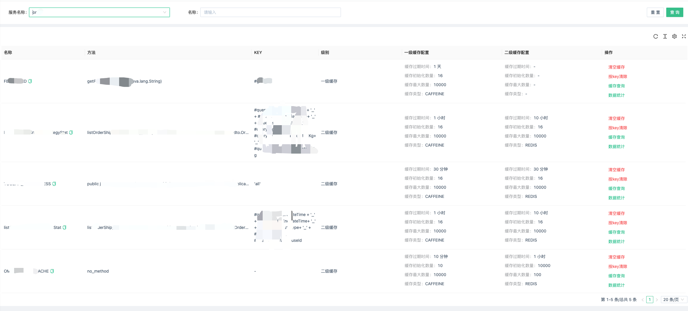
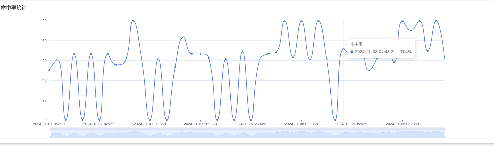
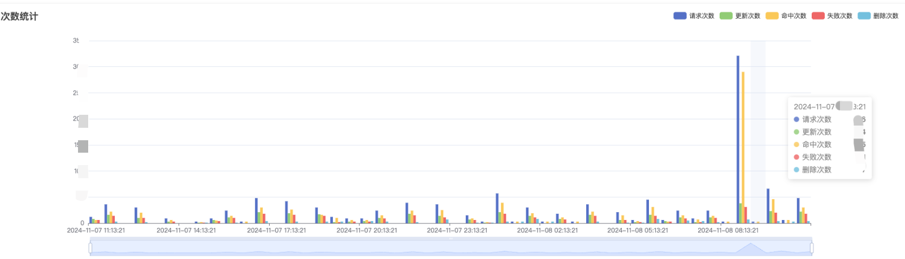
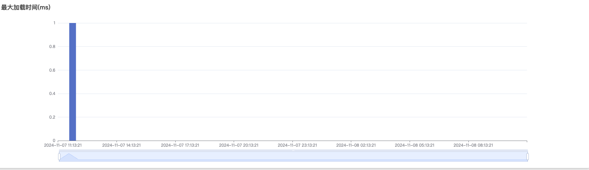

# fluxcache
多级缓存框架(multilevel cache framework)


# 特性

- 自定义一级缓存
- 自定义二级缓存
- 支持Caffeine 分布式删除、更新
- 支持解决缓存雪崩(添加随机过期时间)
- 支持缓存穿透(缓存null)
- `dashboard`操作缓存元数据
- `dashboard`操作缓存清空
- `dashboard`支持缓存按key清空
- `dashboard`支持缓存按key查询
- 纯注解使用，无需关注底层实现
- `dashboard`支持缓存相关监控统计(命中率等)
- 支持`redisson`底层存储自由选择`RMapCache`还是`Bucket`

## 使用

可以参考[fluxcache-example](fluxcache-example)模块。这里简单介绍一下

目前仅支持`spring boot`项目

### 1. 引入依赖

```xml
        <dependency>
            <groupId>io.github.weihubeats</groupId>
            <artifactId>fluxcache-all-spring-boot-starter</artifactId>
            <version>0.0.3</version>
        </dependency>
```

####  spring boot3以上版本请使用如下版本

```xml
        <dependency>
            <groupId>io.github.weihubeats</groupId>
            <artifactId>fluxcache-all-spring-boot-starter</artifactId>
            <version>3.0.0</version>
        </dependency>
```

>相关源码在`spring-boot-3.x`分支

### 2. 启动类添加注解`@EnableFluxCaching`

### 3. 配置redission

```java
@Configuration
public class RedissonConfig {

    @Value("${redis.host}")
    private String redisLoginHost;
    @Value("${redis.port}")
    private Integer redisLoginPort;
    @Value("${redis.password}")
    private String redisLoginPassword;

    @Bean
    public RedissonClient redissonClient() {
        return createRedis(redisLoginHost, redisLoginPort, redisLoginPassword);
    }

    private RedissonClient createRedis(String redisHost, Integer redisPort, String redisPassword) {
        Config config = new Config();
        SingleServerConfig singleServerConfig = config.useSingleServer();
        singleServerConfig.setAddress("redis://" + redisHost + ":" + redisPort + "");
        if (Objects.nonNull(redisPassword)) {
            singleServerConfig.setPassword(redisPassword);
        }
        ObjectMapper objectMapper = new ObjectMapper();
        objectMapper.registerModule(new JavaTimeModule());
        config.setCodec(new JsonJacksonCodec(objectMapper));
        return Redisson.create(config);
    }

}

```

### 4. 使用

目前添缓存的方式有两种

手动和注解方式添加缓存

### 注解添加缓存

- 一级缓存使用`CAFFEINE`
```java
    @GetMapping("/test")
    @FluxCacheable(cacheName = "firstCacheByCaffeine", key = "#name",
        firstCacheable = @FirstCacheable(fluxCacheType = FluxCacheType.CAFFEINE, ttl = 5L, unit = TimeUnit.MINUTES, maxSize = 2000, initSize = 20))
    public List<StudentVO> firstCacheByCaffeine(String name) {
        return mockSelectSql();
    }
```
- 一级缓存使用`redis`

```java
    @GetMapping("/first/redis")
    @FluxCacheable(cacheName = "studentRedis", key = "#name", fluxCacheLevel = FluxCacheLevel.FirstCacheable,
    firstCacheable = @FirstCacheable(fluxCacheType = FluxCacheType.REDIS_R_MAP, ttl = 5L))
    public List<StudentVO> firstCacheByRedisRMap(String name) {
    return mockSelectSql();
}

```

- 1级缓存使用`CAFFEINE`， 二级缓存使用`redis`

```java
    @GetMapping("/local-redis")
    @FluxCacheable(cacheName = "studentLocalRedis", key = "#name", fluxCacheLevel = FluxCacheLevel.SecondaryCacheable,
        firstCacheable = @FirstCacheable(ttl = 1L, fluxCacheType = FluxCacheType.CAFFEINE, maxSize = 2000, initSize = 20),
        secondaryCacheable = @SecondaryCacheable(ttl = 3L, fluxCacheType = FluxCacheType.REDIS_R_MAP))
    public List<StudentVO> secondaryCacheByCaffeineRedis(String name) {
        return mockSelectSql();
    }
```

### 手动添加缓存

也支持自己手动注册管理缓存

实现`FluxCacheDataRegistered`接口，然后在`registerCache`方法中注册自己手动管理的缓存

```java
@Component
public class MyFluxCacheDataRegistered implements FluxCacheDataRegistered {

    public static final String PRODUCT_MANUAL_CACHE = "productManualCache";

    public static final String PRODUCT_MANUAL_MultiLevel_CACHE = "productManualMultiLevelCache";

    public static final String PRODUCT_Redis_First_CACHE = "productRedisFirstCache";

    public static final String PRODUCT_LOCAL_FIRST_CACHE = "productLocalFirstCache";

    @Override
    public List<FluxMultilevelCacheCacheable> registerCache() {
        List<FluxMultilevelCacheCacheable> cacheables = new ArrayList<>();
        FluxCacheCacheableConfig build = new FluxCacheCacheableConfig.Builder()
            .setCacheType(FluxCacheType.CAFFEINE)
            .setMaxSize(100)
            .setTtl(10L)
            .setInitSize(10)
            .setUnit(TimeUnit.SECONDS)
            .build();

        FluxMultilevelCacheCacheable cacheable = new FluxMultilevelCacheCacheable.CacheConfigBuilder()
            .setCacheName(PRODUCT_MANUAL_CACHE)
            .setFluxCacheLevel(FluxCacheLevel.FirstCacheable)
            .setFirstCacheConfig(build)
            .build();


        FluxCacheCacheableConfig build1 = new FluxCacheCacheableConfig.Builder()
            .setCacheType(FluxCacheType.CAFFEINE)
            .setMaxSize(100)
            .setTtl(10L)
            .setInitSize(10)
            .setUnit(TimeUnit.SECONDS)
            .build();

        FluxCacheCacheableConfig build2 = new FluxCacheCacheableConfig.Builder()
            .setCacheType(FluxCacheType.REDIS_R_MAP)
            .setMaxSize(100)
            .setTtl(10L)
            .setInitSize(10)
            .setUnit(TimeUnit.SECONDS)
            .build();


        FluxMultilevelCacheCacheable cacheable1 = new FluxMultilevelCacheCacheable.CacheConfigBuilder()
            .setCacheName(PRODUCT_MANUAL_MultiLevel_CACHE)
            .setFluxCacheLevel(FluxCacheLevel.SecondaryCacheable)
            .setFirstCacheConfig(build1)
            .setSecondaryCacheConfig(build2)
            .build();

        FluxCacheCacheableConfig RedisFirst = new FluxCacheCacheableConfig.Builder()
            .setCacheType(FluxCacheType.REDIS_R_MAP)
            .setMaxSize(100)
            .setTtl(10L)
            .setInitSize(10)
            .setUnit(TimeUnit.SECONDS)
            .build();

        FluxMultilevelCacheCacheable redisFirstCacheable = new FluxMultilevelCacheCacheable.CacheConfigBuilder()
            .setCacheName(PRODUCT_Redis_First_CACHE)
            .setFluxCacheLevel(FluxCacheLevel.FirstCacheable)
            .setFirstCacheConfig(RedisFirst)
            .build();

        FluxCacheCacheableConfig localFirst = new FluxCacheCacheableConfig.Builder()
            .setCacheType(FluxCacheType.CAFFEINE)
            .setMaxSize(100)
            .setTtl(10L)
            .setInitSize(10)
            .setUnit(TimeUnit.SECONDS)
            .build();

        FluxMultilevelCacheCacheable localFirstCacheable = new FluxMultilevelCacheCacheable.CacheConfigBuilder()
            .setCacheName(PRODUCT_LOCAL_FIRST_CACHE)
            .setFluxCacheLevel(FluxCacheLevel.FirstCacheable)
            .setFirstCacheConfig(localFirst)
            .build();

        cacheables.add(cacheable);
        cacheables.add(cacheable1);
        cacheables.add(redisFirstCacheable);
        cacheables.add(localFirstCacheable);
        return cacheables;
    }
}
```

## 内置缓存管理接口

默认同意请求前缀为`/cache/manager/v1`，详细接口返回情况可以查看[FluxCacheController.java](fluxcache-admin%2Fsrc%2Fmain%2Fjava%2Fcom%2Ffluxcache%2Fadmin%2Fcontroller%2FFluxCacheController.java)

如果想要自定义可以通过配置`flux.cache.prefix`进行设置

### 获取所有缓存使用统计请求

`/getAllStatics`

### 查看指定缓存数据

`/getValue`

### 查看所有缓存

`/all/caches`

### 清理指定缓存

`/evict`

### 清理所有缓存

`/clear`

# dashboard









