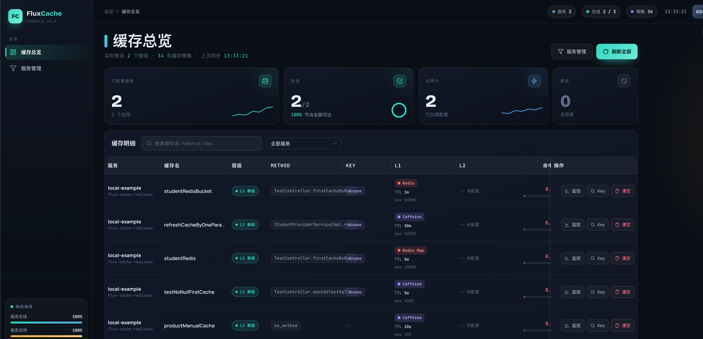
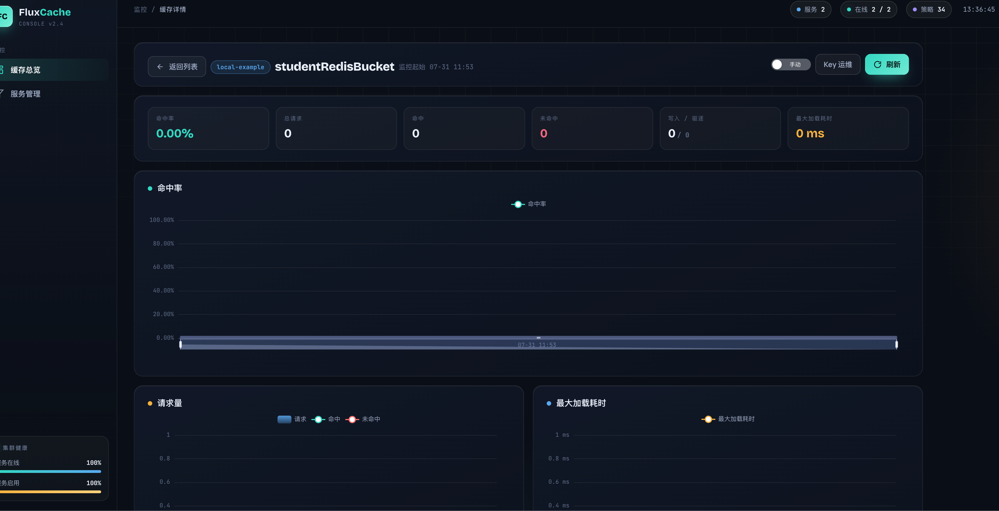

# fluxcache

[](https://github.com/weihubeats/fluxcache/actions/workflows/ci.yml)
[](https://codecov.io/gh/weihubeats/fluxcache)

多级缓存框架 (multilevel cache framework)

A lightweight multilevel cache framework for Spring Boot applications. Supports Caffeine L1 and Redis L2 cache with cache penetration/breakdown/avalanche protection, distributed cache invalidation via Pub/Sub, single-flight cache loading, and a built-in cache management dashboard. Annotate-based usage, compatible with Spring Data Redis and Redisson.

## 特性

- 自定义一级 / 二级缓存
- 支持 Caffeine 分布式删除、更新（基于 Redis Pub/Sub）
- 支持解决缓存雪崩（随机过期时间）
- 支持缓存穿透（缓存 null）
- 支持缓存击穿防护（单飞 single-flight：同一 key 并发未命中仅一个线程加载，其余线程复用结果）
- Dashboard 操作缓存元数据 / 清空 / 按 key 查询与清理
- Dashboard 缓存命中率等监控统计
- 纯注解使用
- **多 Redis 客户端**：默认 Spring Data Redis；Redisson 可选独立模块（含 `REDIS_MAP` / RMapCache）

## 页面






## 模块

```
fluxcache
├── fluxcache-core                          核心引擎与抽象（无 Redis 客户端依赖）
├── flux-cache-spring-boot-starter/         Spring Boot Starter 父模块
│   ├── fluxcache-redis-spring              Spring Data Redis 实现（REDIS）
│   ├── fluxcache-redis-redisson            Redisson 实现（REDIS + REDIS_MAP），不依赖 spring-data-redis
│   ├── fluxcache-admin                     Dashboard REST
│   └── fluxcache-all-spring-boot-starter   默认入口：redis-spring + admin
└── fluxcache-example/                      示例项目
```

## 使用

目前仅支持 Spring Boot。可参考：

- [fluxcache-example-starter](fluxcache-example/fluxcache-example-starter)（默认）
- [fluxcache-example-redisson](fluxcache-example/fluxcache-example-redisson)

### 1. 引入依赖（推荐）

```xml
<dependency>
    <groupId>io.github.weihubeats</groupId>
    <artifactId>fluxcache-all-spring-boot-starter</artifactId>
    <version>0.0.4</version>
</dependency>
```

默认包含 Spring Data Redis 实现与 admin。应用需提供 `RedisConnectionFactory`（Boot 自动配置或自行声明）。

Spring Boot 3 请使用 `spring-boot-3.x` 分支上的 `3.0.0` 版本。

### 仅使用 Redisson（不引入 spring-data-redis）

```xml
<dependency>
    <groupId>io.github.weihubeats</groupId>
    <artifactId>fluxcache-redis-redisson</artifactId>
    <version>0.0.4</version>
</dependency>
<dependency>
    <groupId>io.github.weihubeats</groupId>
    <artifactId>fluxcache-admin</artifactId>
    <version>0.0.4</version>
</dependency>
```

并提供 `RedissonClient` Bean。引入哪个 Redis 模块就用哪套实现，互斥依赖即可。

### 2. 启动类添加 `@EnableFluxCaching`

### 3. Redis 连接

**Starter / Spring Data Redis：**

```java
@Bean
public RedisConnectionFactory redisConnectionFactory() {
    return new LettuceConnectionFactory(new RedisStandaloneConfiguration("127.0.0.1", 6379));
}
```

**Redisson：**

```java
@Bean
public RedissonClient redissonClient() {
    Config config = new Config();
    config.useSingleServer().setAddress("redis://127.0.0.1:6379");
    config.setCodec(new JsonJacksonCodec(new ObjectMapper().registerModule(new JavaTimeModule())));
    return Redisson.create(config);
}
```

### 4. 缓存类型

- `CAFFEINE`：本地缓存
- `REDIS`：可移植 Redis KV（Spring Data Redis 或 Redisson Bucket）
- `REDIS_MAP`：仅 Redisson `RMapCache`（按 entry TTL）

### 5. 全局配置（推荐）

先在 `application.yml` 中配置一级/二级缓存默认值，大幅减少每个注解上的重复配置：

```yaml
flux:
  cache:
    first-cache:
      ttl: 5
      time-unit: MINUTES
      cache-type: CAFFEINE
      init-size: 20
      max-size: 2000
    secondary-cache:
      ttl: 5
      time-unit: MINUTES
      cache-type: REDIS
    default-cache-level: FirstCacheable
```

注解上未显式设置的字段（`ttl <= 0`、`initSize/maxSize <= -1`、`fluxCacheType = NULL`）会自动回落到全局配置。

### 6. 注解示例

**一级缓存（完全使用全局 Caffeine 默认值）：**

```java
@FluxCacheable(cacheName = "firstCacheByCaffeine", key = "#name")
public List<StudentVO> firstCacheByCaffeine(String name) {
    return mockSelectSql();
}
```

**一级 Redis（仅覆盖缓存类型与 TTL）：**

```java
@FluxCacheable(cacheName = "studentRedis", key = "#name",
    firstCacheable = @FirstCacheable(fluxCacheType = FluxCacheType.REDIS, ttl = 5L))
public List<StudentVO> firstCacheByRedis(String name) {
    return mockSelectSql();
}
```

**二级缓存 Caffeine + Redis（仅覆盖 TTL，其余走全局）：**

```java
@FluxCacheable(cacheName = "studentLocalRedis", key = "#name",
    firstCacheable = @FirstCacheable(ttl = 1L),
    secondaryCacheable = @SecondaryCacheable(enabled = true, ttl = 3L))
public List<StudentVO> secondaryCacheByCaffeineRedis(String name) {
    return mockSelectSql();
}
```

> 二级缓存通过 `secondaryCacheable.enabled = true` 自动推断，无需显式声明 `fluxCacheLevel`。

### 7. 手动注册缓存

实现 `FluxCacheDataRegistered`，在 `registerCache` 中返回 `FluxMultilevelCacheCacheable` 列表（示例见 example 模块）。

### 8. 缓存刷新

使用 `@FluxRefresh`（需 Redis 模块提供 `FluxDistributedLock`）：

```java
@FluxCacheable(
    cacheName = "studentCache",
    key = "#name",
    refresh = @FluxRefresh(
        enabled = true,
        provider = StudentMultipleKeysProvider.class,
        fixedRate = 1,
        initialDelay = 0,
        unit = TimeUnit.MINUTES,
        preheatOnStartup = true
    )
)
```

## Dashboard

引入 starter（含 admin）后访问管理端能力；前端见 `fluxcache-dashboard`

## 基准测试（Benchmark）

`fluxcache-benchmark` 基于 JMH，对比 FluxCache 与 Spring Caffeine Cache 的吞吐/延迟，及单飞（single-flight）防击穿效果。默认不参与构建，需激活 profile：

运行：

```bash
# 方式一：直接运行脚本（编译 + 生成 JSON 结果到 docs/benchmark/）
./fluxcache-benchmark/run-benchmark.sh

# 方式二：仅构建，手动指定类与参数
mvn clean package -Pbenchmark -Dgpg.skip=true
java -jar fluxcache-benchmark/target/benchmarks.jar FluxCacheLatencyBenchmark -rf json
```

主要场景：

- `FluxCacheThroughputBenchmark`：FluxCache vs Spring Caffeine 本地缓存吞吐
- `FluxCacheLatencyBenchmark`：FluxCache（含 L1/L2）vs 纯 Redis vs Spring Caffeine 延迟对比
- `SingleFlightPenetrationBenchmark`：并发缓存穿透时开启/关闭单飞的命中与耗时对比

结果写入 `docs/benchmark/results.json`（JMH JSON 汇总），完整报告见 [docs/benchmark/BENCHMARK-REPORT.md](docs/benchmark/BENCHMARK-REPORT.md)。

### 最新结果（2026-08-04，Apple M2 Max / JDK21 / JMH 1.37）

| 指标 | 结果 |
| --- | --- |
| L1 命中延迟（完整注解链路 / 直接 API） | `0.385 µs` / `0.038 µs`，相对纯 Redis（2.475 ms）快 **6,400x / 65,000x** |
| 90% L1 / 10% L2 混合读吞吐 | `31,494 ops/s`，纯 Redis 全远程仅 `2,808 ops/s`，高 **11.2x** |
| 并发击穿（16 线程同一冷 key） | 单飞开启吞吐 `9,180 ops/s` vs 关闭 `1,609 ops/s`，高 **5.7x** |
| 击穿 → DB 调用 | 单飞开启 `0.042 次/op` vs 关闭 `1.43 次/op`，减少约 **34x** |
| 框架成本（L2 命中相对纯 Redis） | 仅 **+4.4%** |

> 环境与方法说明：纯 Redis 基线以 2 ms 固定延迟模拟同城/局域网 RTT（结果随真实 RTT 线性变化）；FluxCache 一律走完整注解链路（SpEL + 拦截器 + 单飞 + 监控 + 多级缓存），即生产真实路径。单飞机制将击穿时的 N 次 DB 调用收敛为 1 次 + 结果共享。

## 质量门禁

CI（`mvn verify`）内置 JaCoCo 覆盖率检查：`fluxcache-core` 行覆盖率 ≥ 85%、分支覆盖率 ≥ 85%，不达标构建失败。覆盖率报告见 `fluxcache-core/target/site/jacoco/`，并上报 Codecov。
