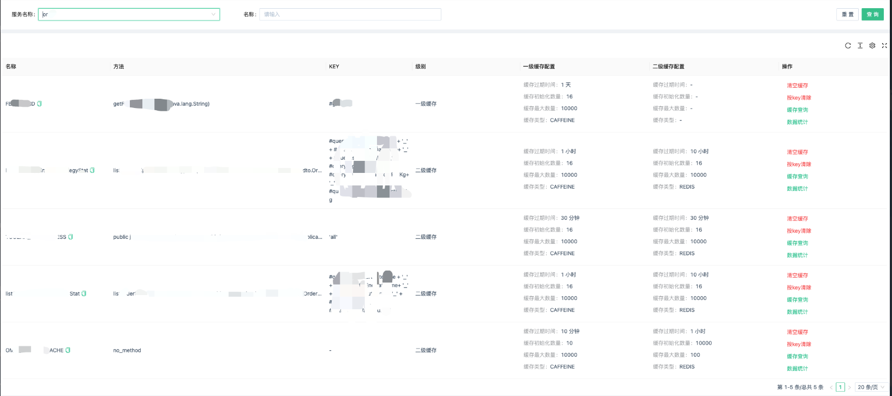

# fluxcache
多级缓存框架(multilevel cache framework)


# 特性

- 自定义一级缓存
- 自定义二级缓存
- 支持Caffeine 分布式删除、更新
- 支持解决缓存雪崩(添加随机过期时间)
- 支持缓存穿透(缓存null)
- `dashboard`操作缓存元数据
- `dashboard`操作缓存清空
- `dashboard`支持缓存按key清空
- `dashboard`支持缓存按key查询
- 纯注解使用，无需关注底层实现
- `dashboard`支持缓存相关监控统计(命中率等)
- 支持`redisson`底层存储自由选择`RMapCache`还是`Bucket`

## 使用

可以参考[fluxcache-example](fluxcache-example)模块。这里简单介绍一下

目前支持手动和注解方式添加缓存

### 注解添加缓存

- 一级缓存使用`CAFFEINE`
```java
    @GetMapping("/test")
    @FluxCacheable(cacheName = "firstCacheByCaffeine", key = "#name",
        firstCacheable = @FirstCacheable(fluxCacheType = FluxCacheType.CAFFEINE, ttl = 5L, unit = TimeUnit.MINUTES, maxSize = 2000, initSize = 20))
    public List<StudentVO> firstCacheByCaffeine(String name) {
        return mockSelectSql();
    }
```
- 一级缓存使用`CAFFEINE`

# dashboard




