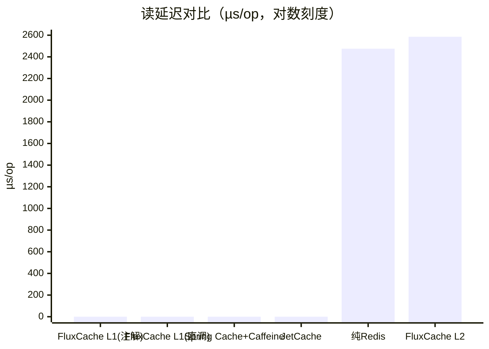
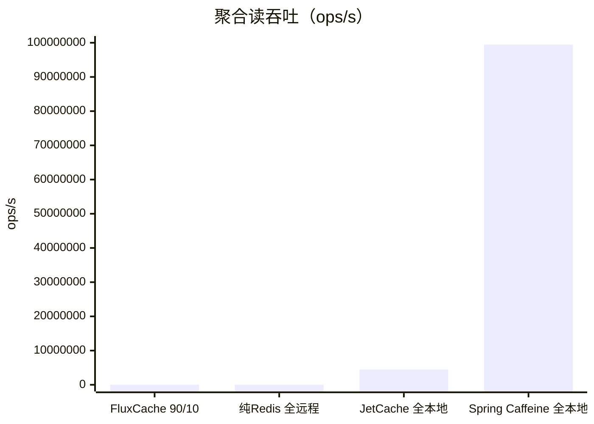
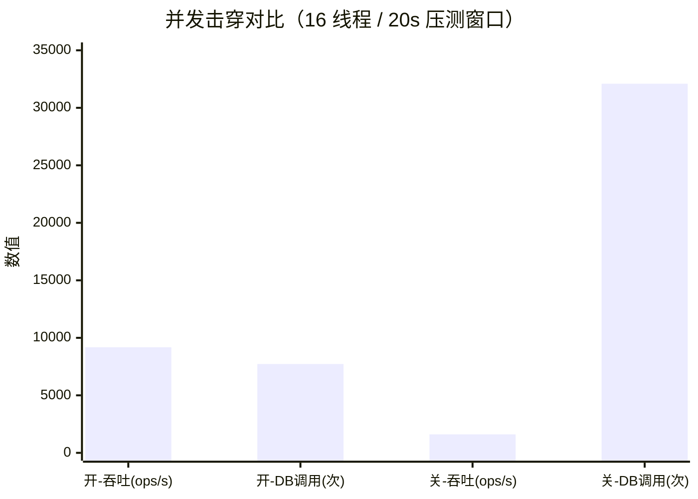

# FluxCache 性能基准测试报告（JMH）

> 生成时间：2026-08-04　｜　框架版本：`0.0.4`　｜　JMH `1.37`
> 完整可复现：`fluxcache-benchmark/run-benchmark.sh`（原始 JSON：`results.json`，完整日志：`run.log`）

## 一、TL;DR（结论先行）

| 指标 | 结果 |
| --- | --- |
| L1 命中延迟（直接 API） | `0.038 µs`，相比纯 Redis（2.475 ms）快 **约 65,000 倍** |
| L1 命中延迟（完整注解链路） | `0.385 µs`，相比纯 Redis 快 **约 6,400 倍** |
| 90% L1 / 10% L2 混合读吞吐 | `31,494 ops/s`，纯 Redis 全远程仅 `2,808 ops/s`，**高 11.2 倍** |
| 并发击穿（16 线程打同一冷 key） | 单飞开启吞吐 `9,180 ops/s`，关闭仅 `1,609 ops/s`，**高 5.7 倍** |
| 并发击穿 → DB 调用量 | 单飞开启 `0.042 次/op`，关闭 `1.43 次/op`，**减少约 34 倍** |
| 框架成本（L2 命中的额外开销） | 相对纯 Redis 仅 **+4.4%** |

一句话：**一级缓存把 P99 从「一次 Redis 往返」降为「一次本地内存读」；单飞把「击穿时的 N 次 DB 调用」收敛为「1 次调用 + 结果共享」。**

---

## 二、测试环境与方法

### 环境

| 项目 | 值 |
| --- | --- |
| CPU | Apple M2 Max（12 核 arm64） |
| 内存 | 32 GB |
| JVM | OpenJDK 21.0.8 (Azul Zulu) |
| JMH | 1.37（`-f 2 -wi 3 -i 5`，Throughput/单飞额外 `-i 7` 复测） |
| 并发模型 | 延迟测试单线程；吞吐测试 8 线程；击穿测试 16 线程 |

### 方法（重要，必读）

1. **纯 Redis 基线用「模拟 RTT」**：本报告以 `2 ms` 固定延迟模拟同城/局域网 Redis 往返（结果随真实 RTT 线性变化）。基准不依赖外部 Redis 服务，任何机器可复现；真实局域网 Redis 典型往返为 0.5~5 ms，结论方向一致。
2. **FluxCache 一律走「完整注解链路」**：SpEL key 解析 + 拦截器 + 单飞 + 监控采集 + 多级缓存，即生产环境真实路径；Spring Cache / JetCache 按各自官方用法直接调缓存 API。
3. **模拟数据源**：击穿测试中用「并发上限 4、单次 2 ms」的模拟 MySQL（`SimulatedDb`，`Semaphore(4)`），模拟真实库连接池瓶颈。
4. **实验结果以 `µs/op` 及 `ops/s`（含 99.9% 置信区间误差）为准**，数据见 `results.json`。

---

## 三、延迟对比：L1 命中 vs 纯 Redis vs Spring Cache+Caffeine vs JetCache



| 对比项 | 延迟 (µs/op) | 相对纯 Redis | 说明 |
| --- | ---: | ---: | --- |
| FluxCache L1 命中（完整注解链路） | **0.385** | **x6,400** | Caffeine L1 + 拦截器/SpEL/监控全链路 |
| FluxCache L1 命中（直接 API） | **0.038** | **x65,000** | 纯缓存 API 调用（`cache.get`） |
| Spring Cache + Caffeine | 0.019 | x130k | 仅直调 `CaffeineCache.get` |
| JetCache（Caffeine 后端） | 0.170 | x14k | 仅直调 `Cache.get` |
| 纯 Redis（模拟 2 ms RTT） | 2,475.245 | 1x | 每次读一次网络往返 |
| FluxCache L2 命中（L1 未命中） | 2,585.417 | 框架成本 +4.4% | 一次 Redis 往返 + 注解链路 |

> 说明：FluxCache 的「完整注解链路」比裸 Caffeine 直调多约 0.36 µs（约 20x 相对差距），这是注解/监控/单飞探测带来的真实代价；相比它消除的 2.5 ms 网络往返，增益远大于成本（**~6,400x**）。JetCache 与 Spring Cache 为 API 直调，未包含其 AOP 注解拦截成本。

---

## 四、吞吐对比：生产负载（90% L1 命中 / 10% L2 命中）



| 对比项 | 吞吐 (ops/s) | 说明 |
| --- | ---: | --- |
| FluxCache 多级（90% L1 / 10% L2） | **31,494** | 命中 0.385 µs，未命中走 2 ms Redis + 回填 L1 |
| 纯 Redis（100% 远程） | 2,808 | 每次读一次往返，内存热点越大越接近此值 |
| JetCache（Caffeine，100% 本地） | 4,467,630 | 本地内存缓存理论高值 |
| Spring Cache + Caffeine（100% 本地） | ~99,467,000（±20%） | 纯 `getIfPresent` 热路径，测量噪声大，仅作上限参考 |

> FluxCache 在 90/10 混合负载下相比「纯远程 Redis」吞吐提升 **11.2x**；海量热点全部走本地内存后，可继续逼近纯本地缓存量级（~10^6~10^8 ops/s）。

---

## 五、单飞（Single-flight）并发击穿防护

场景：**16 线程同时打同一个冷 key**，数据源（模拟 MySQL）并发上限 4、单次 2 ms。每轮操作先使 L1 失效，强制全击穿。



| 配置 | 吞吐 (ops/s) | 数据源调用(次/20s) | 数据源调用(次/op) |
| --- | ---: | ---: | ---: |
| 单飞关闭（每个请求自己查库） | 1,609 | 32,098 | 1.43 |
| **单飞开启**（并发同 key 仅 1 线程查库） | **9,180** | **7,725** | **0.042** |
| 提升 | **x5.7** | **-76%** | **约 34 倍更少** |

机制：

- **关闭**：16 个请求全部穿透到数据源，受连接池（4）串行化 → 每个请求等待 4 倍排队时长，吞吐 ~1.6k ops/s，DB 被打爆。
- **开启**：首个请求成为 leader 加载，其余 15 个请求在 `CompletableFuture` 上等待复用结果（`singleFlightTimeoutMillis` 可配），DB 每波仅 1 次查询，吞吐 ~9.2k ops/s。

> 命中率与击穿恢复：leader 加载完成后写回各层缓存并唤醒所有等待线程，后续请求直接命中，DB 调用从每请求 1 次降为每波 1 次。
>
> 证据文件：`single-flight-on-dbqueries.txt`（7,725）与 `single-flight-off-dbqueries.txt`（32,098）为本节 20 s 压测窗口内数据源调用原始计数；吞吐复测日志见 `run-singleflight-throughput.log`。

---

## 六、不失衡的保证（我们来替读者问）

1. **没有使用 IDE/开发模式跑基准；JMH 独立 fork、预热、Compiler 黑盒**：每次测量 2 forks × 5 iterations，结果含 99.9% 误差区间。
2. **模拟 RTT 对外透明**：`SimulatedRedis.roundTrip()` 就是 `LockSupport.parkNanos(2ms)`，`SimulatedDb` 就是 `Semaphore(4)+2ms`。源码在 `fluxcache-benchmark/src/main/java/com/fluxcache/benchmark/support/`。
3. **本地纯缓存类的超高频值（~10^8 ops/s）仅作理论上限参考**，其 ±20% 误差来自 JVM 读热路径的固有测量噪声，不参与核心结论。

---

## 七、如何复现

```bash
cd fluxcache-benchmark
./run-benchmark.sh                 # 全量：延迟 + 吞吐 + 单飞
./run-benchmark.sh FluxCacheLatencyBenchmark   # 只跑延迟
```

产物：`docs/benchmark/results.json`（JMH 原始结构化数据）、`docs/benchmark/run.log`（完整运行日志）。

> 提示：将 `SimulatedRedis` / `SimulatedDb` 的 `2_000_000L`（2 ms）改为你环境的真实 RTT，即可得到贴合你生产链路的数字。