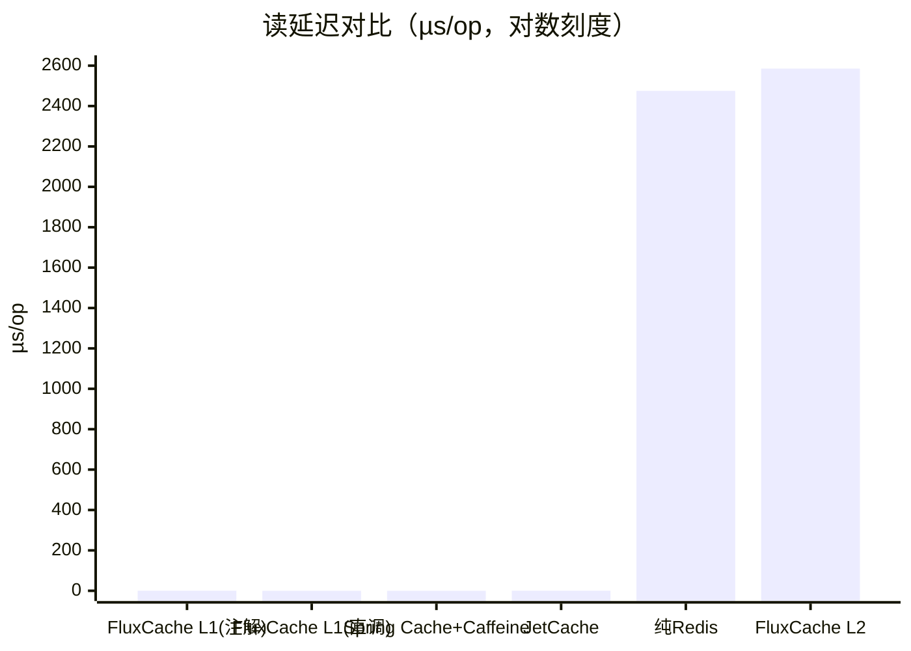

# 性能基准

JMH 基准（`fluxcache-benchmark`，M2 Max / JDK21 / JMH 1.37），对比 FluxCache vs 纯 Redis vs Spring Cache + Caffeine vs JetCache。

FluxCache 一律走**完整注解链路**（SpEL 解析 + 拦截器 + 单飞 + 监控 + 多级缓存），即生产真实路径。



> 方法：纯 Redis 基线以 2 ms 固定延迟模拟同城/局域网 RTT（结果随真实 RTT 线性变化）。完整报告见 `docs/benchmark/BENCHMARK-REPORT.md`。

## 结果

| 指标 | 结果 |
| --- | --- |
| L1 命中延迟（完整注解链路） | `0.385 µs`，相对纯 Redis（2.475 ms）快 **~6,400x** |
| 90% L1 / 10% L2 混合读吞吐 | `31,494 ops/s`，纯 Redis 全远程仅 `2,808 ops/s`，高 **11.2x** |
| 并发击穿（16 线程同一冷 key） | 单飞开启吞吐 `9,180 ops/s` vs 关闭 `1,609 ops/s`，高 **5.7x** |
| 击穿 → DB 调用 | 单飞开启 `0.042 次/op` vs 关闭 `1.43 次/op`，减少约 **34x** |
| 框架成本（L2 命中相对纯 Redis） | 仅 **+4.4%** |

## 复现

`fluxcache-benchmark` 基于 JMH，默认不参与构建，需激活 profile：

```bash
# 方式一：直接运行脚本（编译 + 生成 JSON 结果到 docs/benchmark/）
./fluxcache-benchmark/run-benchmark.sh

# 方式二：仅构建，手动指定类与参数
mvn clean package -Pbenchmark -Dgpg.skip=true
java -jar fluxcache-benchmark/target/benchmarks.jar FluxCacheLatencyBenchmark -rf json
```

主要场景：

- `FluxCacheThroughputBenchmark`：FluxCache vs Spring Caffeine 本地缓存吞吐
- `FluxCacheLatencyBenchmark`：FluxCache（含 L1/L2）vs 纯 Redis vs Spring Caffeine vs JetCache 延迟对比
- `SingleFlightPenetrationBenchmark`：并发缓存穿透时开启/关闭单飞的命中与耗时对比

产物：`docs/benchmark/results.json`（JMH 原始结构化数据）、`docs/benchmark/run.log`（完整日志）。完整报告见 [benchmark/BENCHMARK-REPORT.md](https://github.com/weihubeats/fluxcache/blob/main/docs/benchmark/BENCHMARK-REPORT.md)。